# kubeoptix-harvester

> Estrazione, sanitizzazione e anonimizzazione automatizzata degli artefatti del cluster OpenShift per l'analisi offline.

---

## Indice

- [Panoramica](#panoramica)
- [Prerequisiti](#prerequisiti)
- [Struttura del Progetto](#struttura-del-progetto)
- [Avvio Rapido](#avvio-rapido)
- [Installazione Helm su OpenShift](#installazione-helm-su-openshift)
- [Token Git per Clone Privato](#token-git-per-clone-privato)
- [Flusso di Estrazione e Trattamento](#flusso-di-estrazione-e-trattamento)
- [Riferimento agli Script](#riferimento-agli-script)
  - [run.sh](#runsh)
  - [oc_collect_worknodes.sh](#oc_collect_worknodessh)
  - [oc_collect_all_namespaces.sh](#oc_collect_all_namespacessh)
  - [oc_collect_namespace.sh](#oc_collect_namespacesh)
  - [oc_remove_secret_manifests.sh](#oc_remove_secret_manifestssh)
  - [anonymization.py](#anonymizationpy)
- [Struttura dell'Output](#struttura-delloutput)
- [Configurazione](#configurazione)
- [Note sulla Sicurezza](#note-sulla-sicurezza)

---

## Panoramica

**kubeoptix-harvester** è un toolkit shell + Python che si connette a un cluster OpenShift attivo e raccoglie uno snapshot strutturato delle sue risorse. Dopo la raccolta, il toolkit rimuove automaticamente i manifest di tipo `Secret` e anonimizza i pattern di dati sensibili (CPF, email, token, certificati, dati bancari ecc.) prima che gli artefatti siano messi a disposizione per l'analisi.

L'intero processo viene avviato da un unico script (`run.sh`) e mostra una barra di avanzamento animata su una singola riga durante tutta l'esecuzione.

---

## Prerequisiti

| Requisito | Versione | Note |
|---|---|---|
| `oc` (OpenShift CLI) | ≥ 4.x | Deve essere nel `$PATH` |
| `python3` | ≥ 3.9 | Deve essere nel `$PATH` |
| `bash` | ≥ 4.x | Supporto al comando `mapfile` obbligatorio |
| `tput` | qualsiasi | Utilizzato per rilevare la larghezza del terminale |
| Sessione OC attiva | — | `oc login` deve essere stato eseguito |

---

## Struttura del Progetto

```
kubeoptix-harvester/
├── run.sh                              # Punto di ingresso principale
├── requirements.txt                    # Dipendenze Python
├── .gitignore
├── collectors/
│   ├── oc_collect_worknodes.sh         # Raccoglie i YAML dei worker node
│   ├── oc_collect_all_namespaces.sh    # Itera sui namespace
│   ├── oc_collect_namespace.sh         # Raccoglie le risorse per namespace
│   └── oc_remove_secret_manifests.sh   # Rimuove i manifest di tipo Secret
└── src/
    └── anonymization.py               # Mascheramento dei dati sensibili
```

---

## Avvio Rapido

```bash
# 1. Autenticarsi sul cluster OpenShift
oc login https://<api-url>:6443 -u <utente> -p <password>

# 2. Eseguire la pipeline completa
./run.sh --namespaces "mia-app-prd altro-ns" -o ./artefatti

# Opzionale: limitare le righe di log per pod (default: 300)
./run.sh --namespaces "mia-app-prd" --tail-lines 500 -o ./artefatti
```

Lo script si occuperà di:
1. Creare e attivare un ambiente virtuale Python in `.venv/`
2. Installare le dipendenze Python da `requirements.txt`
3. Raccogliere i manifest dei worker node
4. Raccogliere le risorse e i log dei pod per namespace
5. Rimuovere i manifest `Secret` (modalità dry-run predefinita — sicura)
6. Anonimizzare tutti gli artefatti raccolti

---

## Installazione Helm su OpenShift

Usa `install.sh` per eseguire un'installazione pulita tramite Helm su OpenShift.

```bash
# Obbligatorio: passare il file values come argomento
./install.sh -f ./helm/kubeoptix-harvester/values.yaml

# Forma posizionale equivalente
./install.sh ./helm/kubeoptix-harvester/values.yaml
```

Cosa fa `install.sh`:
1. Verifica le CLI richieste (`helm`, `oc`) e la sessione cluster attiva
2. Opzionalmente rimuove release/namespace precedenti quando `RESET=true`
3. Garantisce che il namespace target esista
4. Installa/aggiorna il chart Helm da `./helm/kubeoptix-harvester`
5. Avvia esattamente una build OpenShift (`oc start-build`)
6. Esegue health check della route su `/health`

Variabili ambiente utili:

| Variabile | Default | Descrizione |
|---|---|---|
| `RELEASE` | `kubeoptix-harvester` | Nome release Helm |
| `NS` | `shiftwise-ai` | Namespace di destinazione |
| `RESET` | `true` | Rimuove release e namespace prima dell'installazione |
| `WAIT_BUILD` | `true` | Segue i log build fino al completamento |
| `BUILD_FROM_LOCAL` | `true` | Usa `oc start-build --from-dir=.` per distribuire l'immagine con le modifiche locali |
| `GIT_URI` | `https://github.com/ShiftWise-AI/kubeoptix-harvester.git` | URL sorgente usato solo quando `BUILD_FROM_LOCAL=false` |
| `GIT_REF` | `feature/ocp` | Branch/tag usato solo quando `BUILD_FROM_LOCAL=false` |

Esempi:

```bash
# Non cancellare namespace/release prima della reinstallazione
RESET=false ./install.sh -f ./helm/kubeoptix-harvester/values.yaml

# Avviare build senza attendere in foreground
WAIT_BUILD=false ./install.sh -f ./helm/kubeoptix-harvester/values.yaml

# Forzare build dal Git remoto invece del workspace locale
BUILD_FROM_LOCAL=false ./install.sh -f ./helm/kubeoptix-harvester/values.yaml
```

---

## Token Git per Clone Privato

Poiché il repository sorgente è privato, il BuildConfig OpenShift deve autenticarsi per eseguire il clone.

Imposta nel file values (`build.sourceSecret`):

```yaml
build:
  sourceSecret:
    create: true
    name: github-auth
    username: x-access-token
    token: <IL_TUO_GITHUB_PAT>
```

Permessi minimi del token (Fine-grained PAT):
1. Accesso solo al repository `ShiftWise-AI/kubeoptix-harvester`
2. Permesso repository `Contents: Read-only`
3. Se l'organizzazione usa SSO/SAML, autorizzare il token per l'organizzazione

Note:
1. Helm/OpenShift richiede solo accesso in lettura (clone), non scrittura.
2. Mantieni `values.yaml` fuori dal versionamento e ruota token esposti.

---

## Flusso di Estrazione e Trattamento

```mermaid
flowchart TD
    A([run.sh]) --> B[Configurare venv Python\ne installare dipendenze]
    B --> C

    subgraph STEP1 ["Passo 1 — Worker Node"]
        C[oc_collect_worknodes.sh]
        C --> C1[Elencare i node con\nlabel node-role=worker]
        C1 --> C2[Esportare YAML per node\nin artifacts/worknodes/]
    end

    C2 --> D

    subgraph STEP2 ["Passo 2 — Artefatti dei Namespace"]
        D[oc_collect_all_namespaces.sh]
        D --> D1[Iterare su ciascun namespace]
        D1 --> E[oc_collect_namespace.sh]

        subgraph NS ["Per namespace"]
            E --> E1["Passo 1/3 — Risorse\naggiuntive del namespace\n(oltre 300 tipi di risorsa)"]
            E1 --> E2["Passo 2/3 — Manifest principali\nDeployment · DeploymentConfig\nStatefulSet · ConfigMap\nRoute · Service\nJob · ReplicaSet · HPA"]
            E2 --> E3["Passo 3/3 — Log dei pod\nraggruppati per label app"]
        end
    end

    E3 --> F

    subgraph STEP3 ["Passo 3 — Rimozione dei Secret"]
        F[oc_remove_secret_manifests.sh]
        F --> F1[Scansionare tutti i file .yaml / .yml]
        F1 --> F2{kind: Secret?}
        F2 -- sì --> F3[Eliminare il file]
        F2 -- no --> F4[Ignorare]
    end

    F3 & F4 --> G

    subgraph STEP4 ["Passo 4 — Anonimizzazione"]
        G[anonymization.py]
        G --> G1[Scorrere tutti i file in artifacts/]
        G1 --> G2[Individuare pattern sensibili\nCPF · RG · Email · Telefono\nToken · Certificato · Chiave\nIBAN · SWIFT · Chiave API]
        G2 --> G3[Sostituire con\nplaceholder 'TIPO_RIMOSSO']
        G3 --> G4[Salvare il file in-place]
    end

    G4 --> H([Artefatti pronti\nper l'analisi])

    style STEP1 fill:#1e3a5f,color:#fff
    style STEP2 fill:#1e3a5f,color:#fff
    style STEP3 fill:#1e3a5f,color:#fff
    style STEP4 fill:#1e3a5f,color:#fff
    style H fill:#155724,color:#fff
```



---

## Riferimento agli Script

### `run.sh`

Orchestratore principale. Crea l'ambiente virtuale Python, convalida tutte le dipendenze ed esegue i quattro passi nell'ordine corretto.

```
Utilizzo:
  ./run.sh [--namespaces "ns1 ns2"] [-o <dir_output>] [--tail-lines N]

Opzioni:
  --namespaces   Lista di namespace separati da spazio (obbligatorio)
  -o             Directory di output (fissa in /app/data/assessment)
  --tail-lines   Numero di righe di log per pod (default: 300)
```

Nota: il collector impone una root di output fissa (`/app/data/assessment`). Qualsiasi valore personalizzato di `-o` viene ignorato.

---

### `oc_collect_worknodes.sh`

Elenca tutti i node con il label `node-role.kubernetes.io/worker` ed esporta il manifest YAML completo di ciascuno.

**Output:** `<output_dir>/worknodes/<nome-node>.yaml`

---

### `oc_collect_all_namespaces.sh`

Itera su una lista di namespace e delega la raccolta a `oc_collect_namespace.sh` per ognuno.

---

### `oc_collect_namespace.sh`

Script di raccolta principale. Esegue tre passi ordinati per ciascun namespace:

| Passo | Cosa viene raccolto | Percorso di output |
|---|---|---|
| 1/3 | Risorse aggiuntive del namespace (oltre 300 tipi di CRD) | `<output_dir>/<namespace>/resources/<kind>/<name>.yaml` |
| 2/3 | Manifest principali (Deployment, Service, Route ecc.) | `<output_dir>/<namespace>/apps/<app>/<kind>/<name>.yaml` |
| 3/3 | Log dei pod (raggruppati per label `app`) | `<output_dir>/<namespace>/apps/<app>/pod-logs/<pod>.log` |

Le risorse prive del label `app` vengono archiviate in `__no_app__`.

---

### `oc_remove_secret_manifests.sh`

Scansiona ricorsivamente la directory degli artefatti alla ricerca di file YAML contenenti `kind: Secret` e li elimina.

> **La modalità predefinita è `--dry-run`** (chiamata da `run.sh`). Per eliminare realmente i file, rimuovere il flag.

```
Utilizzo:
  ./collectors/oc_remove_secret_manifests.sh -d <directory> [--dry-run]
```

---

### `anonymization.py`

Scorre l'intera directory degli artefatti e maschera i pattern di dati sensibili tramite sostituzione con espressioni regolari.

| Chiave pattern | Cosa individua |
|---|---|
| `CPF` | Numeri di CPF brasiliani |
| `EMAIL` | Indirizzi email |
| `TOKEN` / `TOKEN_EXPLICITO` | Bearer token, JWT, token di service account |
| `CHAVE_API` | Campi API key / secret |
| `CERTIFICADO_PEM` | Certificati PEM |
| `CHAVE_PRIVADA_PEM` | Chiavi private PEM |
| `SEGREDO_INFRA` | password, secret, dockerconfigjson ecc. |
| `IBAN` / `SWIFT_BIC` | Identificatori bancari internazionali |

Le occorrenze vengono sostituite con `[<TIPO>_RIMOSSO]`.

```
Utilizzo:
  python3 src/anonymization.py <directory> [--backup]
```

---

## Struttura dell'Output

Dopo un'esecuzione completa, la directory degli artefatti avrà la seguente struttura:

```
/app/data/assessment/
├── worknodes/
│   ├── worker-node-01.yaml
│   └── worker-node-02.yaml
└── <namespace>/
    ├── apps/
    │   ├── <nome-app>/
    │   │   ├── deployments/
    │   │   ├── configmaps/
    │   │   ├── services/
    │   │   ├── routes/
    │   │   └── pod-logs/
    │   └── __no_app__/
    └── resources/
        ├── persistentvolumeclaims/
        ├── serviceaccounts/
        └── ...
```

---

## Configurazione

| Variabile | Default | Descrizione |
|---|---|---|
| `NAMESPACES` | `default ` | Namespace raccolti quando `--namespaces` è omesso |
| `TAIL_LINES` | `300` | Righe di log per pod |
| `OUTPUT_DIR` | `/app/data/assessment` | Directory radice degli artefatti (namespace in `/app/data/assessment/<namespace>`) |
| `VENV_DIR` | `./.venv` | Percorso dell'ambiente virtuale Python |

Il collector viene eseguito con un solo pod (StatefulSet con replicas fisso a 1 e nessun autoscaler configurato).

---

## Note sulla Sicurezza

- I manifest Secret vengono **eliminati** (o elencati in dry-run) prima di condividere gli artefatti.
- Il passo di anonimizzazione maschera credenziali, token, certificati e dati personali in tutti i file.
- Rivedere sempre la directory di output prima di condividerla esternamente.
- Il `.gitignore` esclude gli artefatti generati in `data/` (per esecuzioni locali) e i file di backup `.bak`.

---

*Altre versioni: [English](README.md) · [Português BR](README.pt-br.md)*
