# kubeoptix-harvester

> Automated extraction, sanitization, and anonymization of OpenShift cluster artifacts for offline analysis.

---

## Table of Contents

- [Overview](#overview)
- [Prerequisites](#prerequisites)
- [Project Structure](#project-structure)
- [Quick Start](#quick-start)
- [OpenShift Helm Installation](#openshift-helm-installation)
- [Git Token for Private Clone](#git-token-for-private-clone)
- [Extraction & Processing Flow](#extraction--processing-flow)
- [Scripts Reference](#scripts-reference)
  - [run.sh](#runsh)
  - [oc_collect_worknodes.sh](#oc_collect_worknodessh)
  - [oc_collect_all_namespaces.sh](#oc_collect_all_namespacessh)
  - [oc_collect_namespace.sh](#oc_collect_namespacesh)
  - [oc_remove_secret_manifests.sh](#oc_remove_secret_manifestssh)
  - [anonymization.py](#anonymizationpy)
- [Output Structure](#output-structure)
- [Configuration](#configuration)
- [Security Notes](#security-notes)

---

## Overview

**kubeoptix-harvester** is a shell + Python toolkit that connects to a live OpenShift cluster and collects a structured snapshot of its resources. After collection, the toolkit automatically removes `Secret` manifests and anonymizes any sensitive data patterns (CPF, emails, tokens, certificates, banking data, etc.) before the artifacts are handed off for analysis.

The entire process runs from a single entry-point script (`run.sh`) and provides an animated, single-line progress bar throughout execution.

---

## Prerequisites

| Requirement | Version | Notes |
|---|---|---|
| `oc` (OpenShift CLI) | ≥ 4.x | Must be in `$PATH` |
| `python3` | ≥ 3.9 | Must be in `$PATH` |
| `bash` | ≥ 4.x | `mapfile` support required |
| `tput` | any | Used for terminal width detection |
| Active OC session | — | `oc login` must have been executed |

---

## Project Structure

```
kubeoptix-harvester/
├── run.sh                              # Main entry point
├── requirements.txt                    # Python dependencies
├── .gitignore
├── collectors/
│   ├── oc_collect_worknodes.sh         # Collects worker node YAMLs
│   ├── oc_collect_all_namespaces.sh    # Iterates over namespaces
│   ├── oc_collect_namespace.sh         # Collects resources per namespace
│   └── oc_remove_secret_manifests.sh   # Removes Secret manifests
└── src/
    └── anonymization.py               # Sensitive-data masking
```

---

## Quick Start

```bash
# 1. Authenticate against your OpenShift cluster
oc login https://<api-url>:6443 -u <user> -p <password>

# 2. Run the full pipeline
./run.sh --namespaces "my-app-prd another-ns" -o ./artifacts

# Optional: limit pod log lines (default 300)
./run.sh --namespaces "my-app-prd" --tail-lines 500 -o ./artifacts
```

The script will:
1. Create and activate a Python virtual environment under `.venv/`
2. Install Python dependencies from `requirements.txt`
3. Collect worker node manifests
4. Collect namespace resources and pod logs
5. Remove `Secret` manifests (dry-run mode — safe by default)
6. Anonymize all collected artifacts in-place

---

## OpenShift Helm Installation

Use `install.sh` to run a clean Helm-based installation on OpenShift.

```bash
# Required: pass the values file as argument
./install.sh -f ./helm/kubeoptix-harvester/values.yaml

# Equivalent positional form
./install.sh ./helm/kubeoptix-harvester/values.yaml
```

What `install.sh` does:
1. Validates required CLIs (`helm`, `oc`) and active cluster session
2. Optionally removes previous release/namespace when `RESET=true`
3. Ensures the target namespace exists
4. Installs/upgrades Helm chart from `./helm/kubeoptix-harvester`
5. Triggers exactly one OpenShift build (`oc start-build`)
6. Performs route health check on `/health`

Useful environment variables:

| Variable | Default | Description |
|---|---|---|
| `RELEASE` | `kubeoptix-harvester` | Helm release name |
| `NS` | `shiftwise-ai` | Target namespace |
| `RESET` | `true` | Remove previous release and namespace before install |
| `WAIT_BUILD` | `true` | Follow build logs until build completes |
| `BUILD_FROM_LOCAL` | `true` | Uses `oc start-build --from-dir=.` so deployed image matches local workspace changes |
| `GIT_URI` | `https://github.com/ShiftWise-AI/kubeoptix-harvester.git` | Source repository URL used only when `BUILD_FROM_LOCAL=false` |
| `GIT_REF` | `feature/ocp` | Git branch/tag used only when `BUILD_FROM_LOCAL=false` |
| `scalePolicy.enabled` | `true` | Creates an admission policy that denies scaling the StatefulSet above 1 replica |
| `scalePolicy.maxReplicas` | `1` | Maximum replicas allowed for the harvester StatefulSet |

Examples:

```bash
# Do not delete namespace/release before reinstall
RESET=false ./install.sh -f ./helm/kubeoptix-harvester/values.yaml

# Start build without waiting in foreground
WAIT_BUILD=false ./install.sh -f ./helm/kubeoptix-harvester/values.yaml

# Force build from remote Git source instead of local workspace
BUILD_FROM_LOCAL=false ./install.sh -f ./helm/kubeoptix-harvester/values.yaml
```

---

## Git Token for Private Clone

Because the source repository is private, OpenShift BuildConfig must authenticate to clone it.

Set this in your Helm values file (`build.sourceSecret`):

```yaml
build:
  sourceSecret:
    create: true
    name: github-auth
    username: x-access-token
    token: <YOUR_GITHUB_PAT>
```

Required token permissions (Fine-grained PAT):
1. Repository access: only `ShiftWise-AI/kubeoptix-harvester`
2. Repository permissions: `Contents: Read-only`
3. If organization SSO/SAML is enabled, authorize the token for the organization

Notes:
1. Helm/OpenShift only needs clone (read) access; no write access is required.
2. Keep `values.yaml` out of version control and rotate tokens if exposed.

---

## Extraction & Processing Flow

```mermaid
flowchart TD
    A([run.sh]) --> B[Setup Python venv\n& install requirements]
    B --> C

    subgraph STEP1 ["Step 1 — Worker Nodes"]
        C[oc_collect_worknodes.sh]
        C --> C1[List nodes with\nlabel node-role=worker]
        C1 --> C2[Export YAML per node\nto artifacts/worknodes/]
    end

    C2 --> D

    subgraph STEP2 ["Step 2 — Namespace Artifacts"]
        D[oc_collect_all_namespaces.sh]
        D --> D1[Iterate over each namespace]
        D1 --> E[oc_collect_namespace.sh]

        subgraph NS ["Per namespace"]
            E --> E1["Step 1/3 — Additional\nnamespace resources\n(300+ resource kinds)"]
            E1 --> E2["Step 2/3 — Core manifests\nDeployment · DeploymentConfig\nStatefulSet · ConfigMap\nRoute · Service\nJob · ReplicaSet · HPA"]
            E2 --> E3["Step 3/3 — Pod logs\ngrouped by app label"]
        end
    end

    E3 --> F

    subgraph STEP3 ["Step 3 — Secret Removal"]
        F[oc_remove_secret_manifests.sh]
        F --> F1[Scan all .yaml / .yml files]
        F1 --> F2{kind: Secret?}
        F2 -- yes --> F3[Delete file]
        F2 -- no --> F4[Skip]
    end

    F3 & F4 --> G

    subgraph STEP4 ["Step 4 — Anonymization"]
        G[anonymization.py]
        G --> G1[Walk all files in artifacts/]
        G1 --> G2[Match sensitive patterns\nCPF · RG · Email · Phone\nToken · Certificate · Key\nIBAN · SWIFT · API key]
        G2 --> G3[Replace matches with\n'TYPE_REMOVED' placeholder]
        G3 --> G4[Write file in-place]
    end

    G4 --> H([Artifacts ready\nfor analysis])

    style STEP1 fill:#1e3a5f,color:#fff
    style STEP2 fill:#1e3a5f,color:#fff
    style STEP3 fill:#1e3a5f,color:#fff
    style STEP4 fill:#1e3a5f,color:#fff
    style H fill:#155724,color:#fff
```



---

## Scripts Reference

### `run.sh`

Main orchestrator. Creates the Python virtual environment, validates all dependencies, and runs the four steps in order.

```
Usage:
  ./run.sh [--namespaces "ns1 ns2"] [-o <output_dir>] [--tail-lines N]

Options:
  --namespaces   Space-separated list of namespaces to collect (required)
  -o             Output directory (fixed at /app/data/assessment)
  --tail-lines   Number of log lines to tail per pod (default: 300)
```

Note: the collector enforces a fixed output root (`/app/data/assessment`). Any custom `-o` value is ignored.

---

### `oc_collect_worknodes.sh`

Lists all nodes labeled `node-role.kubernetes.io/worker` and exports their full YAML manifest.

**Output:** `<output_dir>/worknodes/<node-name>.yaml`

---

### `oc_collect_all_namespaces.sh`

Iterates over a list of namespaces and delegates to `oc_collect_namespace.sh` for each one.

---

### `oc_collect_namespace.sh`

Core collection script. Executes three ordered steps per namespace:

| Step | What is collected | Output path |
|---|---|---|
| 1/3 | Additional namespaced resources (300+ CRD kinds) | `<output_dir>/<namespace>/resources/<kind>/<name>.yaml` |
| 2/3 | Core manifests (Deployment, Service, Route, etc.) | `<output_dir>/<namespace>/apps/<app>/<kind>/<name>.yaml` |
| 3/3 | Pod logs (grouped by `app` label) | `<output_dir>/<namespace>/apps/<app>/pod-logs/<pod>.log` |

Resources without an `app` label are stored under `__no_app__`.

---

### `oc_remove_secret_manifests.sh`

Recursively scans the artifact directory for YAML files containing `kind: Secret` and deletes them.

> **Default mode is `--dry-run`** (called from `run.sh`). To actually delete, remove the flag.

```
Usage:
  ./collectors/oc_remove_secret_manifests.sh -d <directory> [--dry-run]
```

---

### `anonymization.py`

Walks the entire artifact directory and masks sensitive data patterns using regex substitution.

| Pattern key | What it matches |
|---|---|
| `CPF` | Brazilian CPF numbers |
| `EMAIL` | Email addresses |
| `TOKEN` / `TOKEN_EXPLICITO` | Bearer tokens, JWT, service account tokens |
| `CHAVE_API` | API key / secret fields |
| `CERTIFICADO_PEM` | PEM certificates |
| `CHAVE_PRIVADA_PEM` | PEM private keys |
| `SEGREDO_INFRA` | password, secret, dockerconfigjson, etc. |
| `IBAN` / `SWIFT_BIC` | International banking identifiers |

Matches are replaced with `[<TYPE>_REMOVIDO]`.

```
Usage:
  python3 src/anonymization.py <directory> [--backup]
```

---

## Output Structure

After a full run, the artifact directory looks like:

```
/app/data/assessment/
├── worknodes/
│   ├── worker-node-01.yaml
│   └── worker-node-02.yaml
└── <namespace>/
    ├── apps/
    │   ├── <app-name>/
    │   │   ├── deployments/
    │   │   ├── configmaps/
    │   │   ├── services/
    │   │   ├── routes/
    │   │   └── pod-logs/
    │   └── __no_app__/
    └── resources/
        ├── persistentvolumeclaims/
        ├── serviceaccounts/
        └── ...
```

---

## Configuration

| Variable | Default | Description |
|---|---|---|
| `NAMESPACES` | `default ` | Namespaces collected when `--namespaces` is omitted |
| `TAIL_LINES` | `300` | Log lines per pod |
| `OUTPUT_DIR` | `/app/data/assessment` | Artifact root directory (namespaces under `/app/data/assessment/<namespace>`) |
| `VENV_DIR` | `./.venv` | Python virtual environment path |

The collector runs as a single pod only (StatefulSet replicas fixed at 1, no autoscaler configured).
At the end of each run, the script prints an explicit en-US completion message with the final artifacts directory.

---

## Security Notes

- Secret manifests are **removed** (or reported in dry-run) before sharing artifacts.
- The anonymization step masks credentials, tokens, certificates, and PII in all files.
- Always review the output directory before sharing it externally.
- The `.gitignore` excludes generated artifacts under `data/` (for local runs) and `.bak` backup files.

---

*Other language versions: [Português BR](README.pt-br.md) · [Italiano](README.it.md)*
