# kubeoptix-harvester

> Extração, sanitização e anonimização automatizada de artefatos de cluster OpenShift para análise offline.

---

## Índice

- [Visão Geral](#visão-geral)
- [Pré-requisitos](#pré-requisitos)
- [Estrutura do Projeto](#estrutura-do-projeto)
- [Início Rápido](#início-rápido)
- [Instalação Helm no OpenShift](#instalação-helm-no-openshift)
- [Token Git para Clone de Repositório Privado](#token-git-para-clone-de-repositório-privado)
- [Fluxo de Extração e Tratamento](#fluxo-de-extração-e-tratamento)
- [Referência dos Scripts](#referência-dos-scripts)
  - [run.sh](#runsh)
  - [oc_collect_worknodes.sh](#oc_collect_worknodessh)
  - [oc_collect_all_namespaces.sh](#oc_collect_all_namespacessh)
  - [oc_collect_namespace.sh](#oc_collect_namespacesh)
  - [oc_remove_secret_manifests.sh](#oc_remove_secret_manifestssh)
  - [anonymization.py](#anonymizationpy)
- [Estrutura da Saída](#estrutura-da-saída)
- [Configuração](#configuração)
- [Notas de Segurança](#notas-de-segurança)

---

## Visão Geral

**kubeoptix-harvester** é um conjunto de scripts shell + Python que se conecta a um cluster OpenShift ativo e coleta um snapshot estruturado de seus recursos. Após a coleta, o toolkit remove automaticamente os manifests do tipo `Secret` e anonimiza padrões de dados sensíveis (CPF, e-mail, tokens, certificados, dados bancários etc.) antes que os artefatos sejam disponibilizados para análise.

Todo o processo é iniciado pelo script `run.sh` e exibe uma barra de progresso animada em uma única linha durante toda a execução.

---

## Pré-requisitos

| Requisito | Versão | Observação |
|---|---|---|
| `oc` (OpenShift CLI) | ≥ 4.x | Deve estar no `$PATH` |
| `python3` | ≥ 3.9 | Deve estar no `$PATH` |
| `bash` | ≥ 4.x | Suporte ao comando `mapfile` obrigatório |
| `tput` | qualquer | Usado para detectar a largura do terminal |
| Sessão OC ativa | — | `oc login` deve ter sido executado |

---

## Estrutura do Projeto

```
kubeoptix-harvester/
├── run.sh                              # Ponto de entrada principal
├── requirements.txt                    # Dependências Python
├── .gitignore
├── collectors/
│   ├── oc_collect_worknodes.sh         # Coleta YAMLs dos worker nodes
│   ├── oc_collect_all_namespaces.sh    # Itera sobre os namespaces
│   ├── oc_collect_namespace.sh         # Coleta recursos por namespace
│   └── oc_remove_secret_manifests.sh   # Remove manifests do tipo Secret
└── src/
    └── anonymization.py               # Mascaramento de dados sensíveis
```

---

## Início Rápido

```bash
# 1. Autentique-se no cluster OpenShift
oc login https://<api-url>:6443 -u <usuario> -p <senha>

# 2. Execute o pipeline completo
./run.sh --namespaces "minha-app-prd outro-ns" -o ./artefatos

# Opcional: limitar linhas de log de pod (padrão: 300)
./run.sh --namespaces "minha-app-prd" --tail-lines 500 -o ./artefatos
```

O script irá:
1. Criar e ativar um ambiente virtual Python em `.venv/`
2. Instalar as dependências Python a partir de `requirements.txt`
3. Coletar os manifests dos worker nodes
4. Coletar recursos e logs de pods por namespace
5. Remover manifests do tipo `Secret` (modo dry-run por padrão — seguro)
6. Anonimizar todos os artefatos coletados

---

## Instalação Helm no OpenShift

Use o `install.sh` para executar uma instalação limpa via Helm no OpenShift.

```bash
# Obrigatório: informar o arquivo values por argumento
./install.sh -f ./helm/kubeoptix-harvester/values.yaml

# Forma posicional equivalente
./install.sh ./helm/kubeoptix-harvester/values.yaml
```

O que o `install.sh` faz:
1. Valida CLIs obrigatórias (`helm`, `oc`) e sessão ativa no cluster
2. Opcionalmente remove release/namespace anterior quando `RESET=true`
3. Garante que o namespace de destino exista
4. Instala/atualiza o chart Helm em `./helm/kubeoptix-harvester`
5. Dispara exatamente um build no OpenShift (`oc start-build`)
6. Executa health check da route em `/health`

Variáveis de ambiente úteis:

| Variável | Padrão | Descrição |
|---|---|---|
| `RELEASE` | `kubeoptix-harvester` | Nome da release Helm |
| `NS` | `shiftwise-ai` | Namespace de destino |
| `RESET` | `true` | Remove release e namespace antes de instalar |
| `WAIT_BUILD` | `true` | Acompanha o build até finalizar |
| `BUILD_FROM_LOCAL` | `true` | Usa `oc start-build --from-dir=.` para publicar a imagem com as alterações locais |
| `GIT_URI` | `https://github.com/ShiftWise-AI/kubeoptix-harvester.git` | URL de origem usada somente quando `BUILD_FROM_LOCAL=false` |
| `GIT_REF` | `feature/ocp` | Branch/tag usada somente quando `BUILD_FROM_LOCAL=false` |

Exemplos:

```bash
# Não remover namespace/release antes da reinstalação
RESET=false ./install.sh -f ./helm/kubeoptix-harvester/values.yaml

# Disparar build sem acompanhar em foreground
WAIT_BUILD=false ./install.sh -f ./helm/kubeoptix-harvester/values.yaml

# Forçar build a partir do Git remoto em vez do workspace local
BUILD_FROM_LOCAL=false ./install.sh -f ./helm/kubeoptix-harvester/values.yaml
```

### Progresso da coleta

Após iniciar uma coleta com `POST /collect`, consulte `GET /collect/status`. A resposta JSON é um valor numérico entre `0` e `100`, por exemplo:

```json
50
```

Uma nova coleta começa em `0` e avança gradualmente conforme namespaces, tipos de recursos e pods são processados. Enquanto houver uma coleta em execução, uma nova chamada a `POST /collect` retorna HTTP `409`.

---

## Token Git para Clone de Repositório Privado

Como o repositório de origem é privado, o BuildConfig do OpenShift precisa de autenticação para clonar.

Configure no arquivo de values (`build.sourceSecret`):

```yaml
build:
  sourceSecret:
    create: true
    name: github-auth
    username: x-access-token
    token: <SEU_GITHUB_PAT>
```

Permissões mínimas do token (Fine-grained PAT):
1. Acesso apenas ao repositório `ShiftWise-AI/kubeoptix-harvester`
2. Permissão de repositório `Contents: Read-only`
3. Se a organização usar SSO/SAML, autorize o token para a organização

Observações:
1. O Helm/OpenShift precisa apenas de acesso de leitura (clone), sem escrita.
2. Mantenha `values.yaml` fora do versionamento e rotacione token exposto.

---

## Fluxo de Extração e Tratamento

```mermaid
flowchart TD
    A([run.sh]) --> B[Configurar venv Python\ne instalar dependências]
    B --> C

    subgraph STEP1 ["Passo 1 — Worker Nodes"]
        C[oc_collect_worknodes.sh]
        C --> C1[Listar nodes com\nlabel node-role=worker]
        C1 --> C2[Exportar YAML por node\npara artifacts/worknodes/]
    end

    C2 --> D

    subgraph STEP2 ["Passo 2 — Artefatos de Namespace"]
        D[oc_collect_all_namespaces.sh]
        D --> D1[Iterar sobre cada namespace]
        D1 --> E[oc_collect_namespace.sh]

        subgraph NS ["Por namespace"]
            E --> E1["Passo 1/3 — Recursos\nadicionar do namespace\n(300+ tipos de recurso)"]
            E1 --> E2["Passo 2/3 — Manifests principais\nDeployment · DeploymentConfig\nStatefulSet · ConfigMap\nRoute · Service\nJob · ReplicaSet · HPA"]
            E2 --> E3["Passo 3/3 — Logs de pods\nagrupados por label app"]
        end
    end

    E3 --> F

    subgraph STEP3 ["Passo 3 — Remoção de Secrets"]
        F[oc_remove_secret_manifests.sh]
        F --> F1[Varrer todos os arquivos .yaml / .yml]
        F1 --> F2{kind: Secret?}
        F2 -- sim --> F3[Excluir arquivo]
        F2 -- não --> F4[Ignorar]
    end

    F3 & F4 --> G

    subgraph STEP4 ["Passo 4 — Anonimização"]
        G[anonymization.py]
        G --> G1[Percorrer todos os arquivos em artifacts/]
        G1 --> G2[Identificar padrões sensíveis\nCPF · RG · E-mail · Telefone\nToken · Certificado · Chave\nIBAN · SWIFT · Chave API]
        G2 --> G3[Substituir por\nplaceholder 'TIPO_REMOVIDO']
        G3 --> G4[Gravar arquivo no lugar]
    end

    G4 --> H([Artefatos prontos\npara análise])

    style STEP1 fill:#1e3a5f,color:#fff
    style STEP2 fill:#1e3a5f,color:#fff
    style STEP3 fill:#1e3a5f,color:#fff
    style STEP4 fill:#1e3a5f,color:#fff
    style H fill:#155724,color:#fff
```



---

## Referência dos Scripts

### `run.sh`

Orquestrador principal. Cria o ambiente virtual Python, valida todas as dependências e executa os quatro passos em ordem.

```
Uso:
  ./run.sh [--namespaces "ns1 ns2"] [-o <diretorio_saida>] [--tail-lines N]

Opções:
  --namespaces   Lista de namespaces separados por espaço (obrigatório)
  -o             Diretório de saída (fixo em /app/data/assessment)
  --tail-lines   Número de linhas de log por pod (padrão: 300)
```

Observação: o coletor força o diretório raiz em `/app/data/assessment`. Qualquer valor customizado de `-o` é ignorado.

---

### `oc_collect_worknodes.sh`

Lista todos os nodes com o label `node-role.kubernetes.io/worker` e exporta o manifesto YAML completo de cada um.

**Saída:** `<output_dir>/worknodes/<nome-do-node>.yaml`

---

### `oc_collect_all_namespaces.sh`

Itera sobre uma lista de namespaces e delega a coleta para `oc_collect_namespace.sh`.

---

### `oc_collect_namespace.sh`

Script de coleta principal. Executa três passos ordenados por namespace:

| Passo | O que é coletado | Caminho de saída |
|---|---|---|
| 1/3 | Recursos adicionais do namespace (300+ tipos de CRD) | `<output_dir>/<namespace>/resources/<kind>/<name>.yaml` |
| 2/3 | Manifests principais (Deployment, Service, Route etc.) | `<output_dir>/<namespace>/apps/<app>/<kind>/<name>.yaml` |
| 3/3 | Logs de pods (agrupados pelo label `app`) | `<output_dir>/<namespace>/apps/<app>/pod-logs/<pod>.log` |

Recursos sem label `app` são armazenados em `__no_app__`.

---

### `oc_remove_secret_manifests.sh`

Varre recursivamente o diretório de artefatos em busca de arquivos YAML contendo `kind: Secret` e os exclui.

> **O modo padrão é `--dry-run`** (chamado pelo `run.sh`). Para excluir de fato, remova o flag.

```
Uso:
  ./collectors/oc_remove_secret_manifests.sh -d <diretorio> [--dry-run]
```

---

### `anonymization.py`

Percorre o diretório de artefatos e mascara padrões de dados sensíveis usando substituição por expressão regular.

| Chave do padrão | O que identifica |
|---|---|
| `CPF` | Números de CPF brasileiros |
| `EMAIL` | Endereços de e-mail |
| `TOKEN` / `TOKEN_EXPLICITO` | Bearer tokens, JWT, tokens de service account |
| `CHAVE_API` | Campos de API key / secret |
| `CERTIFICADO_PEM` | Certificados PEM |
| `CHAVE_PRIVADA_PEM` | Chaves privadas PEM |
| `SEGREDO_INFRA` | password, secret, dockerconfigjson etc. |
| `IBAN` / `SWIFT_BIC` | Identificadores bancários internacionais |


As ocorrências são substituídas por `[<TIPO>_REMOVIDO]`.

```
Uso:
  python3 src/anonymization.py <diretorio> [--backup]
```

---

## Estrutura da Saída

Após uma execução completa, o diretório de artefatos terá a seguinte estrutura:

```
/app/data/assessment/
├── worknodes/
│   ├── worker-node-01.yaml
│   └── worker-node-02.yaml
└── <namespace>/
    ├── apps/
    │   ├── <nome-da-app>/
    │   │   ├── deployments/
    │   │   ├── configmaps/
    │   │   ├── services/
    │   │   ├── routes/
    │   │   └── pod-logs/
    │   └── __no_app__/
    └── resources/
        ├── persistentvolumeclaims/
        ├── serviceaccounts/
        └── ...
```

---

## Configuração

| Variável | Padrão | Descrição |
|---|---|---|
| `NAMESPACES` | `default ` | Namespaces coletados quando `--namespaces` é omitido |
| `TAIL_LINES` | `300` | Linhas de log por pod |
| `OUTPUT_DIR` | `/app/data/assessment` | Diretório raiz dos artefatos (namespaces em `/app/data/assessment/<namespace>`) |
| `VENV_DIR` | `./.venv` | Caminho do ambiente virtual Python |

O coletor roda com apenas 1 pod (StatefulSet com replicas fixo em 1 e sem autoscaler configurado).

---

## Notas de Segurança

- Manifests de Secret são **removidos** (ou listados em dry-run) antes de compartilhar os artefatos.
- O passo de anonimização mascara credenciais, tokens, certificados e dados pessoais em todos os arquivos.
- Sempre revise o diretório de saída antes de compartilhá-lo externamente.
- O `.gitignore` exclui artefatos gerados em `data/` (para execuções locais) e arquivos de backup `.bak`.

---

*Outras versões: [English](README.md) · [Italiano](README.it.md)*
